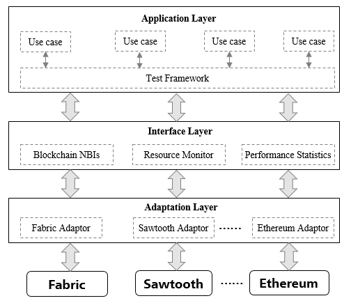

## Architecture


### Adaptation Layer

The adaptation layer is used to integrate existing blockchain system into Caliper framework. Each adaptor implements the 'Caliper Blockchain NBIs' by using corresponding blockchain's native SDK or RESTful API. Hyperledger Fabric1.0 and Sawtooth are current supported now, while Ethereum and other blockchain systems are in the plan.

### Interface&Core Layer

The interface&Core layer implements core functions and provides north bound interfaces for up-applications. Four kinds of NBIs are provided:
* *Blockchain operating interfaces:* contains operations such as deploying smart contracts on backend blockchain, invoking contracts, querying states from the ledger, etc.
* *Resource Monitor:* contains operations to start/stop a monitor and fetch resource consumption status of backend blockchain system, including CPU, memory, network IO, etc. Two kinds of monitors are provided now, one is to watch local/remote docker container, and another is to watch local processes. More monitors will be implemented in the future.
* *Performance Analyzer:* contains operations to read predefined performance statistics (including TPS, delay, success ratio, etc) and print benchmark results. Key metrics are recorded while invoking blockchain NBIs, e.g. created time and committed time of the transaction, result of the transaction, etc. Those metrics are used later to generate the statistics.
* *Report Generator:* contains operations to generate a HTML format testing report
   
### Application Layer

The application layer contains the tests implemented for typical blockchain scenarios. Each test has a configuration file which defines the backend blockchain network and test arguments. These tests can be used directly to test the performance of the blockchain system.

A default benchmark engine is implemented to help developers to understand the framework and implement their own test quickly. How to use the benchmark engine is explained in the latter part. Of course, developers can use NBIs directly to implement their test without the framework.


## Benchmark Engine


### Configuration File
 
Below is a configuration file example:
```json
{
  "blockchain": {
    "type": "fabric",
    "config": "./fabric.json"
  },
  "command" : {
    "start": "docker-compose -f ../../network/fabric/simplenetwork/docker-compose.yaml up -d",
    "end" : "docker-compose -f ../../network/fabric/simplenetwork/docker-compose.yaml down;docker rm $(docker ps -aq)"
  },
  "test": {
    "name": "simple",
    "description" : "This is an example benchmark for caliper",
    "clients": 5,
    "rounds": [{
        "cmd" : "open",
        "txNumbAndTps" : [[5000,100], [5000,200], [5000,300]],
        "arguments": {  "money": 10000 },
        "callback" : "benchmark/simple/open.js"
      },
      {
        "cmd" : "open",
        "txNumbAndTps" : [[5000,400]],
        "arguments": {  "money": 10000 },
        "callback" : "benchmark/simple/open.js",
        "out" : "accounts"
      },
      {
        "cmd" : "query",
        "txNumbAndTps" : [[5000,300], [5000,400]],
        "arguments": {  "accounts":  "*#out" },
        "callback" : "benchmark/simple/query.js"
      }]
  },
  "monitor": {
    "type": ["docker", "process"],
    "docker":{
      "name": ["peer0.org1.example.com", "http://192.168.1.100:2375/orderer.example.com"]
    },
    "process": [
      {
        "command" : "node",
        "arguments" : "bench-client.js",
        "multiOutput" : "avg"
      }
    ],
    "interval": 1
  }
}
```
* **blockchain** - defines the type of backend blockchain system and the configuration file for the adaptor to recognize the backend blockchain network with which to interact. See [*Farbic Config*](./Fabric%20Configuration.md) to learn more details.
* **command** - defines commands which will be called at particular phases of the test
  * **start** : be called at the beginning of the test
  * **end** : be called when finishing all tests
* **test** - defines the number of simulated clients to run the tests concurrently, as well as multiple test rounds, in each test round:
  * **name&description** : human readable name and description of the benchmark, the value is used by the report generator to show in the testing report.
  * **cmd** : hint for the test, e.g name of the command for testing which is called by the smart contract. The value is also used as the context name for *blockchain.getContext()*. 
  * **txNumbAndTps** : defines an array of sub-rounds with different transaction numbers or transaction generating speed. For example, [5000,400] means totally 5000 transactions will be generated and invoked at a speed of 400 transactions per second. In above example, actually six (not three) test rounds are defined.
  * **arguments** : user defined arguments which will be passed directly to the user defined test module. A reserved key string `*#out` is used to declare an argument with output of previous test round (see the explanation of *out* argument).
  * **callback** : specifies the user defined module used in this test round. Please see [User defined test module](#user-defined-test-module) to learn more details.
  * **out** : name of the output of this test rounds. If existed, the output of the user defined module will be cached for later use. If multiple sub-rounds are defined, those outputs will be concatenated as a single output.
* **monitor** - defines the type of resource monitors and monitored objects, as well as the time interval for the monitoring.
  * docker : a docker monitor is used to monitor specified docker containers on local or remote hosts. Docker Remote API is used to retrieve remote container's stats. Reserved container name 'all' means all containers on the host will be watched. In above example, the monitor will retrieve the stats of two containers per second, one is a local container named 'peer0.org1.example.com' and another is a remote container named 'orderer.example.com' located on host '192.168.1.100', 2375 is the listening port of Docker on that host.
  * process : a process monitor is used to monitor specified local process. For example, users can use this monitor to watch the resource consumption of simulated blockchain clients. The 'command' and 'arguments' properties are used to specify the processes. The 'multiOutput' property is used to define the meaning of the output if multiple processes are found. 'avg' means the output is the average resource consumption of those processes, while 'sum' means the output is the summing consumption.  
  * others : to be implemented.

### Master Process

The default test flow contains three stages. The first is 'preparing' stage. In this stage, the application creates and initializes a blockchain object with the configuration file, deploys smart contracts as specified in the configuration and starts a monitor object to monitor the resource consumption of backend blockchain system.

The second stage is 'testing' stage. The application starts a loop to do the test according to the *test* argument. In each test round, multiple child processes are created to perform the task. Testing results from each child process are recorded for later use.
    
The final stage is 'finishing' stage. Performance statistics is generated in this stage.

### Child Process

Nodejs is single-threaded by nature. The default benchmark engine uses cluster to do the actual testing tasks to improve throughput on multi-core machines. The total workload are divided and assigned equally to child processes. A child process acts as a blockchain client with a temporarily generated context to interact with the backend blockchain system. The context usually contains the client's identity and cryptographic materials, and will be released after all the testing tasks are finished.

For Hyperledger Fabric, the context is bound to a specific channel, the relationship is defined in fabric configuration file. 
  
The actual testing task should be implemented in independent modules with specific functions exported. The child process imports such modules to perform actual transactions asynchronously.
 
### User defined test module

Three functions should be implemented and exported, all those functions should return a Promise object.

* `init` - Will be called by a child process at the beginning of the tests with a given blockchain object and context, as well as user defined arguments read from configuration file. The blockchain object and context should be saved for later use, and other initialization work could be implemented in here.
* `run` - The actual transactions should be generated and invoked in here. The child process will call this function repeatedly according to assigned workload, so it is recommended that only one transaction is generated in this function for fine-grained workload control, but of course this is not a MUST requirement. The implementation process should be asynchronous.
* `end` - Will be called by the child process when all the tests are finished, any clearing work should be implemented in here. As explained before, new child processes are created in each test round, so it's impossible to use local variables in the testing module to save data across different test rounds. This function also gives a way to return any data that should be cached for later use. Of course developers could implement their own caching mechanism by using database or file systems, etc.


